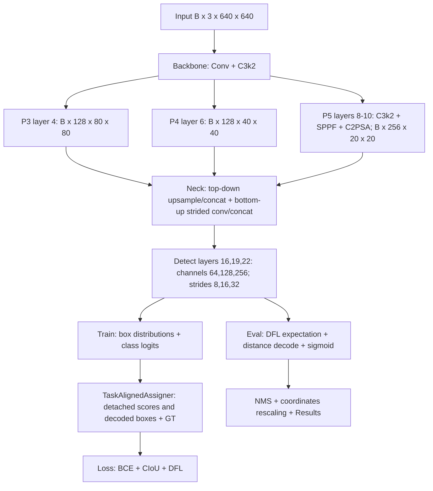

# Phân tích codebase YOLO11

Ngày audit: 2026-09-11. Workspace: `YOLO26`; Git thực tế có root ở thư mục cha `html-example`, commit `8874975d16995587f2310572158cec696caeb740`.

## 1. Trạng thái và phạm vi bằng chứng

Đã kiểm kê cây repository ngoài `.venv`, `.git`, cache Python và artifacts sinh bởi audit; đọc sâu execution path detection và cấu hình baseline. Đã phân tích AST tất cả 296 file Python trong phạm vi kiểm kê (bao gồm script audit), không gặp lỗi cú pháp. Tổng 559 file source/config/Markdown được hash; 247 YAML. Danh mục symbol, dòng định nghĩa và SHA256 nằm trong `experiments/exp000_audit/source_inventory.json`.

Đây **không** phải chứng nhận đã kiểm thử toàn bộ 296 file, mọi kiến trúc, mọi dataset hoặc mọi backend. Binary checkpoints và từng ảnh không được diễn giải như source. Các subsystem segmentation, pose, classification, OBB, SAM, tracking, solutions, HUB được kiểm kê nhưng không có kiểm thử chức năng trong audit detection này.

Đã chạy forward YOLO11n trên input tổng hợp và lưu evidence trong `experiments/exp000_audit/baseline_probe.json`. Chưa train, chưa đánh giá accuracy. Mọi giả thuyết cải thiện: **CHƯA ĐƯỢC XÁC MINH BẰNG THỰC NGHIỆM.**

## 2. Implementation chính xác

- Package được import trực tiếp từ `ultralytics/__init__.py`, tự khai báo version **8.4.103**. Đây là version string của bản vendored, không chứng minh source giống nguyên bản upstream.
- Không có packaging manifest `pyproject.toml`/`setup.py` ở workspace. `requirements.txt` là môi trường phụ thuộc, không pin revision upstream.
- Có YOLO11, YOLO26 và nhiều kiến trúc tùy chỉnh cùng dùng `nn/tasks.py`. Không suy luận implementation từ tên thư mục YOLO26.
- Baseline cần gọi rõ `ultralytics/cfg/models/11/yolo11.yaml`, `scale=n`; không dựa vào constructor mặc định vì `DetectionModel` mặc định chọn YOLO26n.
- `train.py` đang chọn `11/yolo11-Orthogonal/yolo11-orthogonal.yaml`, **không phải baseline**. Recipe hiện tại: apple leaf, 640, batch 32, 150 epochs, SGD, seed 42, CPU, AMP tắt, workers 0, patience 30.
- `CLAUDE.md` hữu ích để định hướng, nhưng một số tên script được nhắc không hiện diện; source đang chạy được ưu tiên hơn tài liệu cũ.

## 3. Cấu trúc và entry points

| Vị trí | Vai trò |
|---|---|
| `train.py`, `train_transcendent.py` | Recipe huấn luyện tùy chỉnh |
| `check_PCB.py`, `count_car.py` | Demo inference, xử lý/hiển thị kết quả ứng dụng |
| `test_yolo_*.py`, `_check*.py` | Smoke scripts, không phải một test suite đầy đủ |
| `ultralytics/models/yolo/model.py` | `YOLO`, task map chọn Model/Trainer/Validator/Predictor |
| `ultralytics/engine/model.py` | `_new`, `_load`, `train`, `val`, `predict`, `export`, callbacks |
| `ultralytics/cfg/__init__.py`, `default.yaml` | Entry CLI ở cấp source, merge/validate arguments và defaults |
| `ultralytics/nn/tasks.py` | Xây graph, parser, routing, criterion, checkpoint loading, fuse |
| `ultralytics/nn/modules/` | Conv/CSP/attention/head và hàng loạt thử nghiệm có sẵn |
| `ultralytics/cfg/models/` | YAML nhiều họ model; baseline YOLO11 ở `11/yolo11.yaml` |
| `ultralytics/data/` | Dataset classes, loader, augmentation; đồng thời chứa hai dataset thực tế |
| `ultralytics/engine/` | Training, prediction, validation, export, Results |
| `ultralytics/nn/autobackend.py`, `nn/backends/` | Backend selection và runtime riêng PyTorch/ONNX/TensorRT/... |
| `ultralytics/utils/` | Loss, assigner, metrics, NMS, benchmark, profiling và callbacks |
| `ultralytics/optim/`, `nn/distill_model.py` | Optimizer bổ sung và distillation; không mặc định dùng cho baseline |
| `plans/` | Ý tưởng kiến trúc cũ; không thay thế logs hoặc literature evidence |

Import `YOLO` lazy ở package root, sau đó imports qua `models` và `nn/tasks.py`; modules tùy chỉnh được import rộng trong `nn/modules/__init__.py`. Vì vậy một dependency lỗi ở module tùy chỉnh có thể ảnh hưởng cả baseline import.

## 4. Parser và module registry

`parse_model` tại `ultralytics/nn/tasks.py:2040`:

1. Đọc `nc`, `scales`, activation, `end2end`, `reg_max` (mặc định 16).
2. Chọn scale; thiếu scale thì lấy key đầu (`n` trong baseline YAML).
3. Resolve tên `nn.*` qua PyTorch, `torchvision.ops.*` qua torchvision, tên khác qua `globals()` trong tasks.
4. Repeat ngoài YAML: `max(round(n * depth), 1)` khi n > 1. Channel: `make_divisible(min(c2,max_channels)*width,8)` cho base modules.
5. `base_modules` và `repeat_modules` là danh sách class cố định. Chỉ export class ở `modules/__init__.py` **chưa đủ**: phải import vào tasks và xử lý channel/repeat đúng.
6. C3k2 làm `legacy=False`; ở scales m/l/x ép c3k=True. Detect nhận `[nc, reg_max, end2end, channels]`; `Detect.legacy` được đặt ở cấp class.
7. Gắn `.i`, `.f`, `.type`, `.np`; lưu các skip outputs trong `save`. `_predict_once` đọc `.f` để lấy tensor từ graph, giữ lại đúng skip cần dùng.

Các scale n/s/m/l/x trong YAML lần lượt có (depth,width,max_channels): (0.5,0.25,1024), (0.5,0.5,1024), (0.5,1,512), (1,1,512), (1,1.5,512). Đây là config đọc từ file, không phải benchmark của các scale lớn.

Rủi ro state chung: YAML có `activation` thay `Conv.default_act` ở cấp class; parser đặt `Detect.legacy`. Regression nên kiểm tra thứ tự build baseline/variant trong cùng process và chạy cả process độc lập. Không monkey-patch globals để thay thế class baseline.

## 5. Architecture và tensor shapes

Shape dưới đây **đo trực tiếp** bằng forward hooks: scale n, B=1, RGB, FP32, 640×640, nc=80, eval, chưa fuse, weights ngẫu nhiên seed 0. Thay nc hoặc scale phải đo lại. Input raw không chia hết stride có thể gây mismatch tại Concat; pipeline LetterBox/check_imgsz phải đảm bảo kích thước phù hợp.

| Index | Module | Output B×C×H×W | Params |
|---|---|---|---:|
| 0 | Conv stride 2 | 1×16×320×320 | 464 |
| 1 | Conv stride 2 | 1×32×160×160 | 4,672 |
| 2 | C3k2 | 1×64×160×160 | 6,640 |
| 3 | Conv stride 2 | 1×64×80×80 | 36,992 |
| 4 | C3k2, backbone P3 | 1×128×80×80 | 26,080 |
| 5 | Conv stride 2 | 1×128×40×40 | 147,712 |
| 6 | C3k2, backbone P4 | 1×128×40×40 | 87,040 |
| 7 | Conv stride 2 | 1×256×20×20 | 295,424 |
| 8 | C3k2 | 1×256×20×20 | 346,112 |
| 9 | SPPF | 1×256×20×20 | 164,608 |
| 10 | C2PSA, backbone P5 | 1×256×20×20 | 249,728 |
| 11 | Upsample | 1×256×40×40 | 0 |
| 12 | Concat with 6 | 1×384×40×40 | 0 |
| 13 | C3k2 | 1×128×40×40 | 111,296 |
| 14 | Upsample | 1×128×80×80 | 0 |
| 15 | Concat with 4 | 1×256×80×80 | 0 |
| 16 | C3k2, neck P3 | 1×64×80×80 | 32,096 |
| 17 | Conv stride 2 | 1×64×40×40 | 36,992 |
| 18 | Concat with 13 | 1×192×40×40 | 0 |
| 19 | C3k2, neck P4 | 1×128×40×40 | 86,720 |
| 20 | Conv stride 2 | 1×128×20×20 | 147,712 |
| 21 | Concat with 10 | 1×384×20×20 | 0 |
| 22 | C3k2, neck P5 | 1×256×20×20 | 378,880 |
| 23 | Detect | eval tensor 1×84×8400, plus raw dict | 464,912 |

Total đo: **2,624,080 parameters**, gồm 16 DFL fixed weights không trainable. Số 6.6 GFLOPs trong comment YAML là metadata cũ, chưa phải phép đo từ audit này.

Backbone: C3k2 kế thừa split/aggregate C2f, thay inner list bằng Bottleneck hoặc C3k; n-scale có một repeat sau depth scaling. SPPF dùng chuỗi 3 max pools kernel 5, concat rồi project. **Trong source hiện tại `SPPF.cv1` có `act=False`** (`block.py:228` lân cận); cần đối chiếu release gốc trước khi gọi đây là reproduction lịch sử. C2PSA chỉ xử lý attention trên một phần channels ở P5, rồi nối với bypass; attention này có phép tương tác token, không nên coi FLOPs chỉ là convolution.

Neck: YAML gọi toàn bộ phần sau backbone là `head`, nhưng phân tích khoa học tách layers 11–22 thành neck, layer 23 thành detection head. Không có P2 output đến detector mặc định.

## 6. Detection head, loss và assignment

`Detect` ở `nn/modules/head.py:37`, constructor dòng 89. YOLO11 mặc định không end-to-end, reg_max=16, strides [8,16,32]. Regression branch gồm hai Conv 3×3 dense và output 1×1; classification branch `legacy=False` dùng depthwise + pointwise hai tầng và output 1×1. Width regression bằng max(16,ch[0]//4,4reg_max)=64 ở n; classification width max(ch[0],min(nc,100))=80 khi nc=80, giảm xuống 64 khi nc=4.

Training output thực tế là dictionary `boxes: B×64×8400`, `scores: B×80×8400`, `feats: [P3,P4,P5]`; không mặc định là list ba tensor như một số phiên bản trước. Eval output `(decoded, raw_dict)` với decoded `B×(4+nc)×8400`. Export trả decoded tensor. Không có objectness logit độc lập. Có anchor points tại tâm grid, không phải predefined anchor-box templates.

`DetectionModel.init_criterion` chọn `v8DetectionLoss`, không chọn E2ELoss nếu end2end=False. `utils/loss.py:336`: BCEWithLogits, task-aligned assignment topk=10, alpha=0.5, beta=6, distribution regression 16 bins. `BboxLoss` dùng CIoU và DFL, foreground được weighted bằng target scores. Loss gain từ default config: box=7.5, cls=0.5, dfl=1.5; trả vector loss nhân batch size, trainer thực hiện reduction/backprop.

`utils/tal.py` chịu trách nhiệm candidate-in-GT, alignment metric, topk, conflict resolution và target-score normalization. Prediction đưa vào assignment đã detach, gradient đi qua prediction loss, không qua phép chọn target. Class weights là tùy chọn `cls_pw`; mặc định 0 nên không bật. Không thấy `loss_type` trong default config: comment `aghiou` ở train.py không chứng minh AGHIoU đang dùng.

## 7. Training data, augmentation, optimizer, scheduler

`models/yolo/detect/train.py` tạo DetectionModel với nc/ch từ data, dataloader từ `data/build.py` và `YOLODataset`; normalize ảnh /255 và chuyển device. `data/augment.py:v8_transforms`: Mosaic/RandomPerspective, CopyPaste theo task, MixUp, CutMix, Albumentations, HSV, flip; `Format` đóng gói labels. Tham số detection mặc định có mosaic=1, mixup=cutmix=copy_paste=0, fliplr=.5, HSV và affine theo `default.yaml`; actual composition còn phụ thuộc package và task.

`engine/trainer.py`: init seed/determinism, optimizer param groups (bias, norm, decayed weights), warmup, accumulation theo nbs, GradScaler/AMP, gradient clipping, EMA, validation, early stop và checkpoint. Scheduler linear mặc định, cosine nếu `cos_lr=True`. `optimizer=auto` hiện có thể chọn MuSGD/AdamW theo iterations; vì thế thí nghiệm phải cố định optimizer, không dùng auto khi cần kiểm soát recipe.

Dataset hiện diện (đếm file ảnh trong split, chưa chứng nhận label quality/dedup):

| Dataset | Train | Val | Test | Classes |
|---|---:|---:|---:|---|
| apple_leaft_detection | 4,556 | 570 | 569 | Black Rot, Powdery_mildew, Rust, scab |
| coco_dataset | 13,300 | 3,798 | 1,900 | bus, car, motorcycle, truck |

`coco_dataset` là vehicles subset 4 lớp từ metadata Roboflow, **không phải COCO 80 lớp chuẩn**. Cả hai YAML dùng `../train/images` và tương tự; `check_det_dataset` có fallback bỏ `../` nếu đường dẫn đầu không tồn tại. Cần lưu resolved absolute paths và hash split trong experiment, tránh dùng nhầm thư mục cha. Chưa xác nhận dataset chính hoặc computational budget từ người dùng.

## 8. Inference, export và benchmark

Inference: `YOLO.predict` → DetectionPredictor/BasePredictor → source loader → LetterBox/BGR-to-RGB/BCHW/normalize → AutoBackend → graph → `utils/nms.py` NMS → scale boxes về original image → Results. `check_PCB.py` thêm filter class, cross-class dedup, visualization và disk writes: phải tách các bước này khỏi model-only latency.

`engine/exporter.py` chọn format, deepcopy/eval/fuse model, thiết lập precision/shape/dynamic/export flags rồi export backend; có wrapper NMS khi yêu cầu. `nn/backends/` chứa PyTorch, ONNX, TensorRT, OpenVINO và các backend khác. Có source không đồng nghĩa runtime đã được cài hoặc custom operations export được. Chưa chạy export trong phase audit.

Utilities: `BaseModel._profile_one_layer` đo module, gọi THOP trên deepcopy để tránh làm bẩn model; chỉ có timing tổng hợp, không cung cấp đủ percentile/activation peak/memory bandwidth. `utils/torch_utils.py` có model info/FLOPs/profiling; `utils/benchmarks.py:benchmark` so format và metric nhưng mặc định model là YOLO26, imgsz=160, data có thể rơi về coco8. Không dùng defaults đó cho paper. `ProfileModels` có profiling ONNX/TensorRT. `ops.Profile` đồng bộ CUDA cho pipeline timing; cần thêm samples mean/median/P95 và phân biệt model-only với end-to-end.

Audit probe hiện có 5 warmup, 30 samples, CPU một thread FP32, random weights, no fusion, tensor đã ở RAM, không NMS; raw samples đã lưu. Chỉ là kiểm tra hoạt động, không phải latency GPU hoặc baseline accuracy reproduction.

## 9. Checkpoint và pretrained compatibility

`Model._load` → `nn/tasks.py:load_checkpoint` → `torch_safe_load`, chọn EMA hoặc model, merge train_args với defaults, chuẩn hóa FP32, gắn stride/task/path, optional fuse. Có compatibility remapping và restricted-loading policy trong source.

`BaseModel.load` lấy state_dict, optional remap class rows theo tên, intersect key + shape rồi `strict=False`; một phần tensor không load là có thể dự kiến khi đổi kiến trúc/nc nhưng **không đồng nghĩa pretrained hoàn toàn tương thích**. Báo cáo phải thống kê transferred/total và danh sách keys thiếu, không chỉ thấy load không lỗi.

Ba `.pt` gốc hiện có là `yolo11-bifpn-ca.pt`, `yolov8-bifpn-mhsa.pt`, `yolov8.pt`; chưa xác minh nội dung bằng load, không coi tên file là provenance. Không tìm thấy `best.pt`, `last.pt`, `results.csv`, `args.yaml` của run baseline trong vùng tìm kiếm. Baseline reference do audit tạo chỉ là **weights ngẫu nhiên**, tuyệt đối không dùng để báo cáo mAP.

Thay đổi topology có thể làm mất tương thích state keys; giữ module cũ, YAML cũ và import path cũ. Export deployment model riêng sau khi copy, kiểm tra numerical equivalence trước/sau fuse. `fuse()` hiện chứa danh sách class tùy chỉnh cố định; chưa có extension registry tổng quát.

## 10. Bottleneck tiềm năng, chưa được profile đầy đủ

- Backbone: stage đầu resolution cao có activation lớn; stride-2 dense conv tăng channels tốn MAC; P5 C2PSA có attention matmul cần được tính ngoài conv.
- Neck: upsample rồi concat tạo tensor lớn và project lại; layer 15 tạo 1×256×80×80. Số params bằng 0 không có nghĩa latency/memory bằng 0.
- Head: dense regression Conv trên P3 80×80; nc và reg_max ảnh hưởng budget; classification đã dùng DWConv nên thêm depthwise một cách chung chung có thể không giúp.
- Small objects: thiếu P2 output, stride/augmentation/label assignment có thể ảnh hưởng; không thể quy mọi lỗi vật nhỏ cho backbone khi chưa đọc labels/errors.
- Không suy từ FLOPs sang memory-bound, GPU kernel time, FPS hoặc bandwidth. Cần measured profile với scope/operator coverage công bố rõ.

## 11. Môi trường và các cổng kiểm chứng

Python 3.9.13; torch 2.2.2+cpu; torchvision 0.17.2; numpy 1.26.4; timm 1.0.22. `torch.version.cuda=None`, `torch.cuda.is_available=False`. NVIDIA-SMI thấy RTX 4060 Laptop-class GPU với 8188 MiB, WDDM, driver 616.92; GPU visibility **không** đồng nghĩa Python có CUDA runtime. GPU model name đầy đủ cần lưu truy vấn bổ sung trước benchmark.

Phase 0 đạt mức xác định execution path + forward baseline tại local revision. Reproduction lịch sử YOLO11, pretrained provenance, backward/loss, CUDA/AMP, export và toàn bộ model families **chưa đạt gate**. Chưa chỉnh sửa bất kỳ source/model YAML gốc. Chỉ thêm công cụ audit, artifacts và báo cáo.

Đối chiếu sau audit: [SPPF ở tag v8.3.0](https://raw.githubusercontent.com/ultralytics/ultralytics/v8.3.0/ultralytics/nn/modules/block.py) có activation mặc định ở cv1; local tắt activation. Đây là khác biệt constructor đã xác nhận, không do audit tạo ra. [Detect v8.3.0](https://raw.githubusercontent.com/ultralytics/ultralytics/v8.3.0/ultralytics/nn/modules/head.py) là nguồn so head lịch sử. Không tự sửa behavior local. GPU đầy đủ: NVIDIA GeForce RTX 4060 Laptop GPU. `polars` và `pytest` chưa cài; utility benchmark cần polars nên chưa gọi được chỉ với dependencies hiện có.

Kiểm chứng bổ sung sau Phase 0: `research/profile_baseline.py` đã pass strict state_dict/output roundtrip, standard fuse tolerance và batch-2 rectangular real detection loss/backward finite; 527 file Ultralytics giữ nguyên hash. `research/audit_dataset.py` đã đọc labels và hash ảnh apple, không thấy malformed/missing labels hoặc cross-split exact byte duplicates; có một empty train label. Xem `YOLO11_BOTTLENECK_ANALYSIS.md` và `RESEARCH_STATUS.md` để phân biệt những kiểm tra đã bổ sung với trạng thái ở thời điểm Phase 0. CUDA/AMP, export và pretrained historical reproduction vẫn chưa được kiểm chứng.

Tiếp theo: hoàn thiện literature và xác định baseline/data/budget; chỉ thiết kế/triển khai sau khi có bottleneck và nearest works đủ rõ. Không khởi chạy training để lấp đầy bảng khi baseline chưa được xác nhận.
