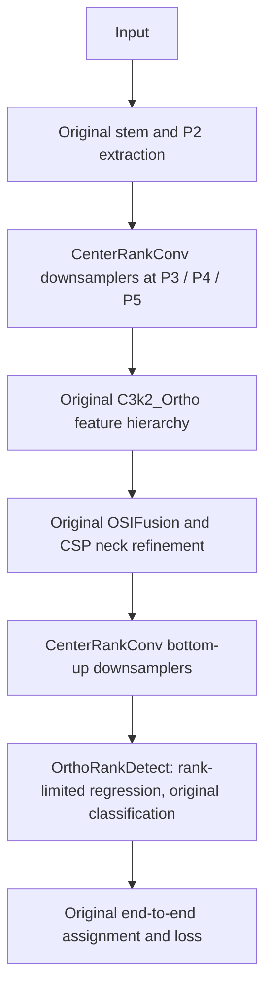

# Orthogonal-Rank: actual architecture experiment

**Superseded recommendation:** the user subsequently prioritized retaining capacity while merely staying lighter than stock YOLO11. Use `ORTHOGONAL_CAPACITY.md` and `yolo11-orthogonal-capacity.yaml` for the current candidate. The B+C results below remain valid as an earlier efficiency ablation; B+C ratio0.25 is no longer the default training recommendation.

Date: 2026-09-12. This revision changes trainable computation, not just inference scheduling. Current engineering candidate: **B+C, ratio0.25**. It reduces measured complexity and CPU latency; scientific decision remains **REVISE pending trained accuracy evidence**. The design below was recorded before implementation.

## Problem and measured target

`experiments/orthogonal_rank/original_conv_profile.json` profiles actual fused Orthogonal-n, nc80, batch1, 640 square. Conv2d total is 5.5642752 GFLOPs using two operations/MAC. Head21 uses 1.8696832 GFLOPs (33.60%); its two P3 box 3x3 layers each use 0.4718592. Backbone downsamplers3/5 also each use 0.4718592. OHR fusion removes training branches but still leaves dense, full-width spatial kernels. Reordering postprocessing did not sufficiently address these costs.

## Hypothesis and architecture

Separate center-pixel channel mixing from neighboring-pixel interaction. The former retains an unrestricted matrix; the latter uses a learned reduced output subspace. For X with Ci channels, choose r=aligned(ratio*min(Ci,Co)). Compute Z=OHR(Ci->r, activation=False)(X), and Y=SiLU(BN(PW(concat(center_sample(X),Z)))). Stride2 center_sample selects X[:,:,::2,::2], aligned with padded 3x3 convolution. OHR retains its rich training branches and deploy fusion, now producing only r channels. PW jointly mixes raw center channels and spatial responses. The name inherits Orthogonal; branch kernels are **not** guaranteed mutually orthogonal during training.

In eval, the effective spatial kernel is W_delta = D*1[delta=0] + U*K_delta, where D is Co x Ci, U is Co x r and K_delta is r x Ci. Off-center matrices share an output subspace of rank <=r. The center matrix is not forced through this bottleneck. Unlike simply shrinking the whole feature tensor, every output still has access to every center input channel. Spatial evidence can still be lost at low r, especially for small/occluded objects. This is an inductive bias requiring accuracy validation, not information-loss-free compression.

Deploy kernel weights (bias/BN excluded) = 9*Ci*r + (Ci+r)*Co, versus 9*Ci*Co for dense3x3. Example Ci=Co=64, r=16: 14,336 versus 36,864, a **calculated** 61.11% reduction at that operator. Activations include an extra r-channel map and concat(Ci+r); lower arithmetic does not guarantee less peak memory or lower latency. Training OHR branch cost differs from deployed cost. Early stem, P2 feature extractor, output widths, spatial strides, classification head, assignment and loss remain fixed for controlled ablation.

Three placements use the same principle:

- A: replace OHR spatial operators inside existing C3k2_Ortho containers; retain CSP feature paths and repeats.
- B: replace both dense3x3 regression convolutions per scale, retaining regression output width, reg_max16, two-layer receptive-field depth, class tower and end-to-end dual assignment.
- C: replace downsampling Conv nodes3/5/7/15/18; retain stem0/1 and P2 processing.

Create all eight A/B/C combinations from the **original** Orthogonal config. Do not include previous Efficient or selected-decoding changes, which would confound architectural attribution. Sensitivity ratios 0.25/0.375/0.5 are candidate capacity settings, not optimized values. Select an engineering candidate using actual latency and complexity; scientific acceptance remains pending mAP and training ablation.

## Initialization and why this is more than a rename

For a pretrained dense/OHR kernel, separate its center matrix D and flatten the eight remaining offsets into M of shape Co x (8*Ci). Rank-r SVD initializes U and K to minimize off-center Frobenius reconstruction error; center weights and bias are retained exactly (up to floating point). The SVD spatial rows form an orthonormal initial basis; unconstrained subsequent training does not preserve orthogonality. This transfer is **approximate**, unlike previous execution-only variants. Report layerwise reconstruction error. Matching unaffected tensors can be copied, but old weights cannot be loaded strictly into changed module layouts. Both native new-model checkpoint roundtrip and historical baseline regressions need tests.

## Nearest work and limits of contribution

| Primary source | Relationship | Difference to test, not an originality claim |
|---|---|---|
| [Training CNNs with Low-Rank Filters, arXiv1511.06744](https://arxiv.org/abs/1511.06744) | Low-rank convolution/factorized filters are established | Center matrix exempted from the spatial rank constraint; deployment placements in Orthogonal |
| [FasterNet, CVPR2023](https://arxiv.org/abs/2303.03667) | Concentrate spatial computation in fewer channels | Here the narrow spatial branch reads all input channels, and an unrestricted center matrix bypasses the factorization |
| [LRPRNet/LPRNet, arXiv1910.11853](https://arxiv.org/abs/1910.11853) | Low-rank pointwise computation plus a corrective residual branch | Here pointwise center mixing is unrestricted and neighboring spatial interaction is rank-limited |
| [ACNet, ICCV2019](https://openaccess.thecvf.com/content_ICCV_2019/html/Ding_ACNet_Strengthening_the_Kernel_Skeletons_for_Powerful_CNN_via_Asymmetric_ICCV_2019_paper.html) | Existing asymmetric training-branch fusion underlies OHR | OHR is reused at reduced output rank; its established mechanism is credited |
| [OREPA, CVPR2022](https://openaccess.thecvf.com/content/CVPR2022/html/Hu_Online_Convolutional_Re-Parameterization_CVPR_2022_paper.html) | Prior work studies training/deploy reparameterization | This candidate does not implement OREPA or claim its results |

Originality risk is HIGH; the literature search is not exhaustive and low-rank-plus-direct-path concepts overlap substantially with prior work. This is a concrete local architecture proposal, **not a claimed new scientific principle**. A publication claim requires stronger differentiation, trained comparisons and ablations. mAP, APsmall and universal superiority: **CHƯA ĐƯỢC XÁC MINH BẰNG THỰC NGHIỆM.**

## Implemented candidate

`ultralytics/nn/modules/orthogonal_rank.py` provides CenterRankConv, C3k2_OrthoRank, OrthoRankDetect and approximate SVD transfer. The chosen `ultralytics/cfg/models/11/yolo11-Orthogonal/yolo11-orthogonal-rank.yaml` is B+C with ratio0.25. The original YAML and `train.py` are not changed. The new training entry point is `train_orthogonal_rank.py`.



For n at640: stage3=64x80x80, stage4=128x80x80; stage5/6=128x40x40; stage7/8/9/10=256x20x20. Neck outputs remain 64x80x80,128x40x40,256x20x20. Detection still returns Bx300x6 at default max_det for this input. All channel widths and strides match original; regression internal spatial ranks are reduced. Changed downsamplers and box towers have different trainable graphs and weight layouts. Training is **not** mathematically equivalent to the baseline.

Minimal integration changes in shared source: register/export classes; include CenterRankConv and C3k2_OrthoRank in parser base/repeat sets; preserve the original M/L/X nested-CSP rule for the subclass; register OrthoRankDetect with the existing head constructor handling; dispatch CenterRankConv deployment fusion. `head.py`, the original loss, assigner and trainer implementations are untouched. The SVD initializer deep-copies source Conv before using the vendored in-place fuse helper; a reproduced source-mutation defect in the initial initializer was fixed and covered by regression.

## Actual architectural ablation (not an accuracy ablation)

`experiments/orthogonal_rank/ablation_nc80_run1.json`: Windows, Intel i7-13650HX, torch2.2.2+cpu, FP32, one CPU thread, batch1,640 square, fused eager; 15 warmups/model and40 randomized paired samples. Baseline uses preserved random weights; unchanged tensors are copied into candidates and changed operators receive SVD initialization from the same baseline. This controls source initialization but does not make the architectures numerically equivalent. No mAP is compared in this benchmark.

| Placement | Training-form params | Deploy params | Conv-only GFLOPs | Mean ms | Median ms | P95 ms | FPS |
|---|---:|---:|---:|---:|---:|---:|---:|
| Original | 2,383,960 | 1,813,504 | 5.5642752 | 132.405 | 131.376 | 138.946 | 7.553 |
| A | 2,233,624 | 1,737,680 | 5.3496448 | 134.309 | 131.258 | 155.464 | 7.446 |
| B | 2,070,104 | 1,584,224 | 4.6754432 | 128.513 | 126.500 | 131.728 | 7.781 |
| C | 1,956,440 | 1,371,264 | 4.6697088 | 129.144 | 126.516 | 144.009 | 7.743 |
| A+B | 1,919,768 | 1,508,400 | 4.4608128 | 128.719 | 125.754 | 145.530 | 7.769 |
| A+C | 1,806,104 | 1,295,440 | 4.4550784 | 126.804 | 125.205 | 132.540 | 7.886 |
| **B+C** | **1,642,584** | **1,141,984** | **3.7808768** | **121.873** | **120.941** | **125.367** | **8.205** |
| A+B+C | 1,492,248 | 1,066,160 | 3.5662464 | 120.838 | 120.513 | 124.145 | 8.276 |

A alone reduced arithmetic but was slower in mean latency. A+B+C was only slightly faster than B+C in this run and slightly slower in the confirmation run. Prefer B+C for training because it preserves existing CSP feature extraction with comparable measured latency. This choice reduces changes to learned representations; it is not evidence that B+C has higher accuracy than A+B+C. Keep all eight YAMLs under `configs/research/orthogonal_rank/` for reproducible ablation.

## Confirmation and rank sensitivity

`confirm_nc80_run2.json`: 20 warmups,60 randomized samples, same environment. Original mean133.911/median131.981/P95150.487 ms,7.468FPS; B+C122.442/121.232/132.971 ms,8.167FPS. A+B+C mean123.008 ms. B+C versus original: deploy parameters -37.03%, training-form parameters -31.10%, Conv-only FLOPs -32.05%, mean model-only latency -8.56%, FPS +9.37% in this run. Paired mean saving11.470 ms, within-run bootstrap95% [9.493,13.632]. This is not a universal speed or hardware claim.

`confirm_nc4.json` separately constructs models with4 classes (matching the available apple dataset's class count), using seed7 random source initialization, not dataset images: original deploy1,780,188 params,5.396992 Conv-GFLOPs, mean125.339/median122.965/P95141.010 ms,7.978FPS; B+C1,108,668 params,3.6135936 Conv-GFLOPs,115.069/112.954/130.809 ms,8.690FPS. Paired saving10.270 ms, bootstrap95% [7.692,12.655]. Changing nc alone is not cross-dataset accuracy evaluation.

| B+C rank ratio | Deploy params (nc80) | Conv-only GFLOPs | Same-run original mean ms | Candidate mean / median / P95 ms |
|---|---:|---:|---:|---|
| 0.25 (confirmation) | 1,141,984 | 3.7808768 | 133.911 | 122.442 / 121.232 / 132.971 |
| 0.375 | 1,264,976 | 4.1605760 | 131.439 | 126.810 / 123.762 / 147.253 |
| 0.5 | 1,387,968 | 4.5402752 | 136.271 | 129.093 / 124.285 / 138.098 |

The latter rows are separate40-sample runs, not directly paired comparisons between rank ratios. Ratio0.25 is the initial efficiency candidate, **not an accuracy-tuned optimum**. Larger ratios retain more off-center matrix capacity; only trained sensitivity analysis can establish the accuracy tradeoff.

Counts include actual Conv2d calls, including the DFL projection at two operations/MAC, but exclude softmax, activations, concatenation, resize and elementwise arithmetic. Timings include built-in top-k and exclude preprocessing, loading, disk IO and visualization. Bootstrap covers within-run timing only, not training variance, autocorrelation, multiple-testing correction or uncontrolled hardware power state. GPU latency/peak memory, end-to-end image-pipeline timing and APsmall remain unmeasured.

## Validation and use

Nine architectural unittest methods: eight pass, one CUDA skip. Tests include odd/even spatial shapes, stride1/2, all eight actual loss/backward paths, finite gradients, FP32/FP64 deploy with nontrivial BN, exact-center/rank-constrained SVD reconstruction, full-rank dense-convolution oracle including stride2, unchanged source tensors, all n/s/m/l/x parser topologies, real YOLO checkpoint roundtrip, CPU BF16 autocast, non-end-to-end inference and exact pre-edit stock/Orthogonal snapshots. Dynamic ONNX export via the official YOLO API and ORT CPU checking pass at [1,3,128,160] and [2,3,160,192]; raw logits agree with PyTorch at1e-4 tolerance (largest observed error1.1921e-7). Random tied post-top-k predictions receive shape/finite checks; no claimed exact cross-backend ordering.

```python
from ultralytics import YOLO

model = YOLO('ultralytics/cfg/models/11/yolo11-Orthogonal/yolo11-orthogonal-rank.yaml')
# This creates the new architecture; its initial weights are not trained detections.
```

```powershell
# Exact configs/recipes without starting a long run:
.venv/Scripts/python.exe train_orthogonal_rank.py --variant baseline --prepare-only --seeds 0 1 2
.venv/Scripts/python.exe train_orthogonal_rank.py --variant bc --prepare-only --seeds 0 1 2

# Real full training, on a CUDA-enabled PyTorch environment:
.venv/Scripts/python.exe train_orthogonal_rank.py --variant baseline --device 0 --amp --seeds 0 1 2
.venv/Scripts/python.exe train_orthogonal_rank.py --variant bc --device 0 --amp --seeds 0 1 2

# Matching existing original checkpoint (approximate SVD transfer):
.venv/Scripts/python.exe train_orthogonal_rank.py --variant bc --init path/to/original_orthogonal.pt --device 0 --amp
```

Default data is the repository apple dataset; --data, --scale, --ratio, --imgsz, --batch and --epochs are configurable. Both baseline and candidate use SGD and the same exposed recipe defaults; select matching seeds/precision/hardware for comparisons. The installed PyTorch is CPU-only. Training plots need polars, absent in this environment; --no-plots keeps CSV/metrics and uses the trainer's existing pandas fallback. Original checkpoint class count/scale/end2end must match for SVD transfer; mismatches raise errors. Native new-model checkpoints use normal loading. `YOLO.load(original_weights)` by itself does not perform the SVD conversion. The runner embeds scale in its generated filename because the local YAML loader overrides YAML scale from filename.

No completed multi-seed/full-dataset accuracy study, trained baseline reproduction, small-object error analysis or paper-readiness claim is included. **REVISE:** retain this measurable architecture candidate for controlled training; accept neither an accuracy Pareto improvement nor paper-level originality until those experiments exist.

## Real-data trainer smoke test

The full local trainer was exercised after module tests, using15 copied training images and7 validation images from the existing apple dataset with all4 classes represented. One epoch, seed0,128 square,batch2,CPU,SGD,FP32,plots disabled: both original Orthogonal and B+C completed training, validation, best/last checkpoint saving and final checkpoint reload. Precision/recall/mAP50/mAP50-95 were all0 for both runs; this is a small unrepresentative pipeline check, **not a reasonable reproduced accuracy baseline** and not evidence of equal accuracy. A further B+C run initialized from the smoke baseline checkpoint via SVD also completed a real training epoch and checkpoint validation, confirming the transfer path is used by the trainer.

Artifacts are in `experiments/orthogonal_rank/trainer_smoke/`: exact image/label hashes, copied subset, training commands/logs, per-run architecture/args, `results.csv`, metrics and weights. `transfer_run/` additionally saves layerwise initialization errors and a source-code archive. Later full runs save code/config ZIP snapshots and hashes, package versions, environment and Git commit; the final experiment-level snapshot covers the completed implementation. Original dataset images/labels are not edited. Optional plots are explicitly disabled in these smoke runs because polars is unavailable; no missing plots are presented as completed analyses.

Run the pipeline check with `.venv/Scripts/python.exe -B research/smoke_train_orthogonal_rank.py`. It does not modify the full training recipe, and its checkpoints must not be mistaken for usable trained detectors. Full accuracy comparison should begin only after the actual original baseline reaches a sensible level under the chosen dataset/hardware/training budget.

Actual serialized FP32 fused state_dict files are7,316,584 bytes for the original and4,639,286 bytes for B+C (`serialized_sizes.json`). File size includes serialization metadata and buffers. This measures model storage, not peak inference memory.

| Research-readiness criterion | Current rating | Reason |
|---|---|---|
| Originality strength | LOW | Substantial low-rank/partial-computation prior art; no independent scientific claim established |
| Technical soundness | MEDIUM | Algebra, gradients, source compatibility and deployment checked; representation/optimization quality needs full training |
| Experimental strength | LOW | Actual CPU architecture ablations and tiny pipeline runs exist; full accuracy, GPU and multi-seed studies do not |
| Reproducibility | HIGH for implemented checks | Source/config archives, exact sample hashes, scripts, environment, raw samples and checkpoints retained |
| Practical significance | MEDIUM | Measured storage/compute/CPU speed reductions; usable detection quality remains unknown |
| Publication risk | HIGH | Both distinct scientific contribution and convincing accuracy/latency Pareto evidence remain unresolved |
